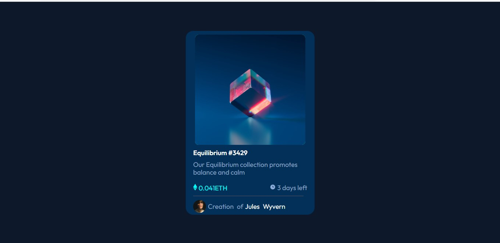

# Frontend Mentor - NFT preview card component solution

This is a solution to the [NFT preview card component challenge on Frontend Mentor](https://www.frontendmentor.io/challenges/nft-preview-card-component-SbdUL_w0U). Frontend Mentor challenges help you improve your coding skills by building realistic projects. 

## Table of contents

- [Overview](#overview)
  - [The challenge](#the-challenge)
  - [Screenshot](#screenshot)
  - [Links](#links)
- [My process](#my-process)
  - [Built with](#built-with)
  - [What I learned](#what-i-learned)
  - [Continued development](#continued-development)
  - [Useful resources](#useful-resources)
- [Author](#author)
- [Acknowledgments](#acknowledgments)

**Note: Delete this note and update the table of contents based on what sections you keep.**

## Overview

### The challenge

Users should be able to:

- View the optimal layout depending on their device's screen size
- See hover states for interactive elements

### Screenshot

### Links

- Solution URL: [Click here](https://www.frontendmentor.io/challenges/nft-preview-card-component-SbdUL_w0U)
- Live Site URL: [Click here](matheusfeliperuiz.github.io/NFT/)

## My process

### Built with

- Semantic HTML5 markup
- CSS custom properties
- Flexbox
- Media queries CSS
- Mobile-first workflow

### What I learned

In this problem I learned about opacity and how I can change the image when the mouse go over.

### Useful resources

- [Example resource 1](https://www.youtube.com/@vidafullstack2431) - This channel helped me too much to solve this problem.

## Author

- Linkedin - [Matheus Ruiz](https://www.linkedin.com/in/matheus-felipe-ruiz-gon%C3%A7alves-ti/)
- Frontend Mentor - [Matheus Felipe Ruiz Gonçalves](https://www.frontendmentor.io/profile/MatheusFelipeRuiz)

